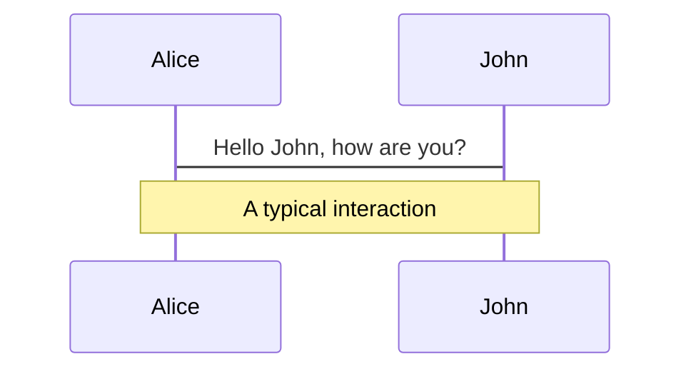
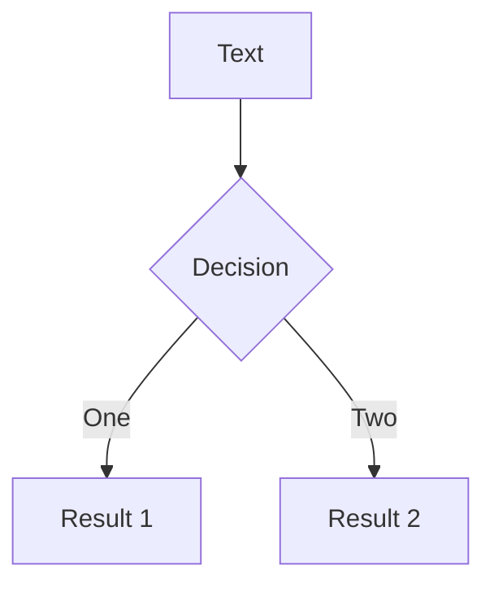
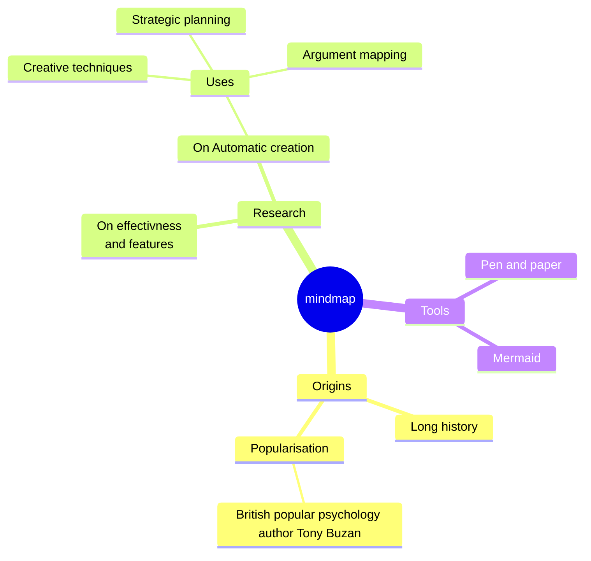
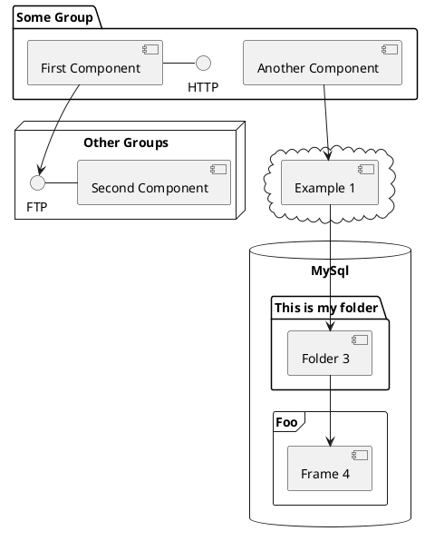

# Supabaseの紹介

<div class="flex justify-center pt-10">
  
</div>

<div class="pt-12">
  <span @click="$slidev.nav.next" class="px-2 py-1 rounded cursor-pointer" hover="bg-white bg-opacity-10">
    Press Space for next page <carbon:arrow-right class="inline"/>
  </span>
</div>

---
transition: fade-out
---


<div class="flex pb-5">
  <div class="px-5">
    <div class="rounded-full bg-white w-30 h-30 overflow-hidden border-2 border-black border-dotted border-opacity-20">
      
    </div>
  </div>
  <div class="mt-11">
    <h2><b>自己紹介</b></h2>
  </div>
</div>
<br />

- 📝 飯野陽平（[wheatandcat](https://github.com/wheatandcat)）
- 🏢 法人設立（[合同会社UNICORN](https://www.unicornllc.dev/) 代表社員）
- 💻 Work: シェアフル株式会社CTO
- 📚 Blog: https://www.wheatandcat.me/
- 🛠 今までに作ったもの
  - [memoir](https://memoir-lp-mvbeacmwe-wheatandcat.vercel.app/)
  - [ペペロミア](https://peperomia.app/)
  - [MarkyLinky](https://github.com/wheatandcat/MarkyLinky)

<style>
ul {
  padding-left: 1rem;
  margin-top: 0.1rem;
}
li {
  @apply font-500;
  font-size:1.15rem;
}
a {
  color: #84b9cb;
  @apply font-500;
}
</style>


---
layout: default
---

# Supabaseとは？

 - Firebase代替として注目を集めているサービス
 - 現在は以下の機能を提供している
   - Database
   - Authentication
   - Storage
   - Edge Functions

<style>
ul {
  padding-left: 1rem;
  margin-top: 0.1rem;
}
li {
  @apply font-500;
  font-size:1.15rem;
}
a {
  color: #84b9cb;
  @apply font-500;
}
</style>


---
layout: default
---

# Firebaseとの違い

 - 完全オープンソース
 - データベースはPostgreSQLを使用
 - コンソール画面が非常にモダン
 - 機能数はFirebaseの方が多い

<style>
ul {
  padding-left: 1rem;
  margin-top: 0.1rem;
}
li {
  @apply font-500;
  font-size:1.15rem;
}
a {
  color: #84b9cb;
  @apply font-500;
}
</style>


---
transition: slide-up
level: 2
---

# Authentication

 - 認証周りは以下のようなサービスと連携して認証が可能
   - ※ダッシューボードを見せながら説明
   - [リンク](https://supabase.com/docs/guides/auth)
 - 設定はシンプルで使いたいサービスを選択して有効にするだけでOK 👌

<style>
ul {
  padding-left: 1rem;
  margin-top: 0.1rem;
}
li {
  @apply font-500;
  font-size:1.15rem;
}
a {
  color: #84b9cb;
  @apply font-500;
}
</style>


---
layout: default
---

# コード

以下のようなコードで認証は実装可能[^1]

```ts {all|1,5|14|all}
  const handleOAuthLogin = async (provider: Provider, scopes = "email") => {
    await supabase.auth.signInWithOAuth({
      provider,
      options: {
        scopes,
        redirectTo: location.href
      }
    })
  }

  略）

  // ログイン後は以下から認証情報を取得できる
  const { data, error } = await supabase.auth.getSession()
```

[^1]: [Learn More](https://supabase.com/docs/guides/auth)

<style>
.footnotes-sep {
  @apply mt-20 opacity-10;
}
.footnotes {
  @apply text-sm opacity-75;
}
.footnote-backref {
  display: none;
}
</style>

---
transition: slide-up
level: 2
---


# Database

 - 認証周りは以下のようなサービスと連携して認証が可能
   - ※ダッシューボードを見せながら説明
   - [リンク](https://supabase.com/docs/guides/auth)
 - 設定はシンプルで使いたいサービスを選択して有効にするだけでOK 👌

<style>
ul {
  padding-left: 1rem;
  margin-top: 0.1rem;
}
li {
  @apply font-500;
  font-size:1.15rem;
}
a {
  color: #84b9cb;
  @apply font-500;
}
</style>

---

# Database

<div grid="~ cols-2 gap-4">
<div>

You can use Vue components directly inside your slides.

We have provided a few built-in components like `<Tweet/>` and `<Youtube/>` that you can use directly. And adding your custom components is also super easy.

```html
<Counter :count="10" />
```

<!-- ./components/Counter.vue -->
<Counter :count="10" m="t-4" />

Check out [the guides](https://sli.dev/builtin/components.html) for more.

</div>
<div>

```html
<Tweet id="1390115482657726468" />
```

<Tweet id="1390115482657726468" scale="0.65" />

</div>
</div>

<!--
Presenter note with **bold**, *italic*, and ~~striked~~ text.

Also, HTML elements are valid:
<div class="flex w-full">
  <span style="flex-grow: 1;">Left content</span>
  <span>Right content</span>
</div>
-->


---
class: px-20
---

# Themes

Slidev comes with powerful theming support. Themes can provide styles, layouts, components, or even configurations for tools. Switching between themes by just **one edit** in your frontmatter:

<div grid="~ cols-2 gap-2" m="-t-2">

```yaml
---
theme: default
---
```

```yaml
---
theme: seriph
---
```


</div>

Read more about [How to use a theme](https://sli.dev/themes/use.html) and
check out the [Awesome Themes Gallery](https://sli.dev/themes/gallery.html).

---
preload: false
---

# Animations

Animations are powered by [@vueuse/motion](https://motion.vueuse.org/).

```html
<div
  v-motion
  :initial="{ x: -80 }"
  :enter="{ x: 0 }">
  Slidev
</div>
```

<div class="w-60 relative mt-6">
  <div class="relative w-40 h-40">
    
    
    
  </div>

  <div
    class="text-5xl absolute top-14 left-40 text-[#2B90B6] -z-1"
    v-motion
    :initial="{ x: -80, opacity: 0}"
    :enter="{ x: 0, opacity: 1, transition: { delay: 2000, duration: 1000 } }">
    Slidev
  </div>
</div>

<!-- vue script setup scripts can be directly used in markdown, and will only affects current page -->
<script setup lang="ts">
const final = {
  x: 0,
  y: 0,
  rotate: 0,
  scale: 1,
  transition: {
    type: 'spring',
    damping: 10,
    stiffness: 20,
    mass: 2
  }
}
</script>

<div
  v-motion
  :initial="{ x:35, y: 40, opacity: 0}"
  :enter="{ y: 0, opacity: 1, transition: { delay: 3500 } }">

[Learn More](https://sli.dev/guide/animations.html#motion)

</div>

---

# LaTeX

LaTeX is supported out-of-box powered by [KaTeX](https://katex.org/).

<br>

Inline $\sqrt{3x-1}+(1+x)^2$

Block
$$
\begin{array}{c}

\nabla \times \vec{\mathbf{B}} -\, \frac1c\, \frac{\partial\vec{\mathbf{E}}}{\partial t} &
= \frac{4\pi}{c}\vec{\mathbf{j}}    \nabla \cdot \vec{\mathbf{E}} & = 4 \pi \rho \\

\nabla \times \vec{\mathbf{E}}\, +\, \frac1c\, \frac{\partial\vec{\mathbf{B}}}{\partial t} & = \vec{\mathbf{0}} \\

\nabla \cdot \vec{\mathbf{B}} & = 0

\end{array}
$$

<br>

[Learn more](https://sli.dev/guide/syntax#latex)

---

# Diagrams

You can create diagrams / graphs from textual descriptions, directly in your Markdown.

<div class="grid grid-cols-3 gap-10 pt-4 -mb-6">









</div>

[Learn More](https://sli.dev/guide/syntax.html#diagrams)

---
src: ./pages/multiple-entries.md
hide: false
---

---
layout: center
class: text-center
---

# Learn More

[Documentations](https://sli.dev) · [GitHub](https://github.com/slidevjs/slidev) · [Showcases](https://sli.dev/showcases.html)
